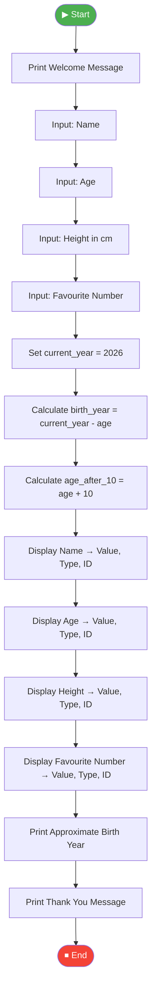

[README.md](https://github.com/user-attachments/files/29753499/README.md)
<div align="center">

# 🚀 Fundamental Booster — Personal Data Collector

### An Interactive Python Program to Explore Data Types, Variables & Memory IDs


</div>

---

## 📌 Problem Statement

Beginners learning Python often struggle to visualize **how variables actually work** — what type of data they hold, and how Python stores them in memory. This program solves that by acting as a simple **Personal Data Collector**: it takes basic personal details from the user (name, age, height, favourite number), then reveals the **value, data type, and memory ID** of each variable, and finally calculates the user's **approximate birth year**.

It's a hands-on way to bridge the gap between "writing code" and "understanding what's happening under the hood."

---

## 🎯 Objectives

- ✅ Collect user input interactively via the console (`input()`)
- ✅ Demonstrate different Python data types — `str`, `int`, `float`
- ✅ Show how to inspect a variable's **value**, **type**, and **memory address (`id()`)**
- ✅ Perform simple arithmetic operations (calculating birth year, age after 10 years)
- ✅ Practice clean, readable output formatting using f-strings and `print()`
- ✅ Build foundational confidence with core Python fundamentals

---

## 🛠️ Tech Stack

| Technology | Purpose |
|---|---|
|  | Core programming language |
| 🖥️ Console I/O | `input()` / `print()` for interaction |
| 🔡 Built-in Functions | `type()`, `id()`, `int()`, `float()` |

**No external libraries required** — pure, beginner-friendly Python!

---

## 🔄 Program Flow



---

## 🖥️ Sample Output


```text
WELCOME TO THE INTERACTIVE PERSONAL DATA COLLECTOR 
Enter Your Name: Pankti
Enter Your Age: 21
Enter Your Height (in cm): 165
Enter Your Favourite Number: 7

NAME
Value : Pankti
Type : <class 'str'>
ID : 140312837442672

Age
Value : 21
Type : <class 'int'>
ID : 9793152

Height
Value : 165.0
Type : <class 'float'>
ID : 140312837412144

Favourite Number
Value : 7
Type : <class 'int'>
ID : 9793056

Approximate Birth Year : 2005
Thank you for using the Personal Data Collector
Have A Great Day!
```

---

## 📂 How to Run

```bash
# Clone the repository
git clone https://github.com/Panktipatel18/Fundamental-booster.git

# Navigate into the folder
cd Fundamental-booster

# Run the script
python "PR.1 FUNDAMENTAL BOOSTER.py"
```

---

## 👩‍💻 Author

<div align="center">

**Pankti Patel**

[](https://github.com/Panktipatel18)

</div>

---

<div align="center">

⭐ If you found this helpful, consider giving the repo a star!

</div>
